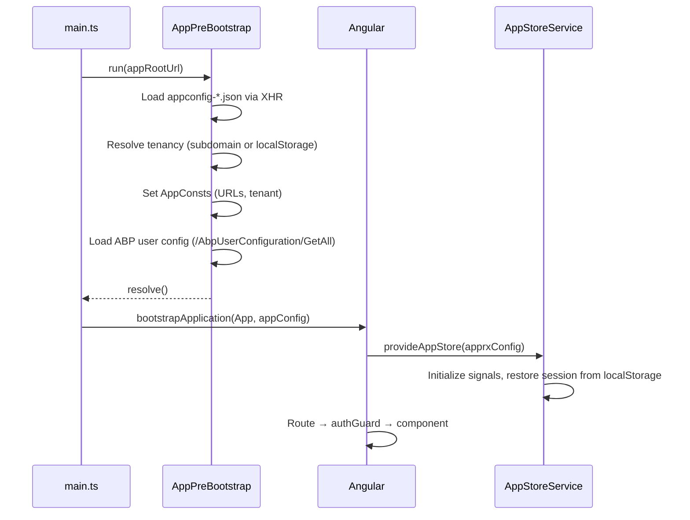

# APPRX 2.0 — Developer Guide

## Quick Start

```bash
# Install dependencies
npm install

# Start development server (APPRX environment)
npm run dev-apprx

# Start development server (Plattform environment)
npm run dev-plattform
```

The build output goes to `dist/` and is watched for changes. Open the app via the URL in your `appconfig-*.json` or `http://localhost:4200`.

---

## Project Root — What's What

```
ui/
├── .agent/                    # Agent workflows + project rules
│   ├── rule-book/RULES.md     # Coding rules (enums, state, LESS, context docs)
│   └── workflows/             # Agent workflows (browser-testing, create-nexus-app)
├── .editorconfig              # 2-space indent, single quotes for .ts
├── angular.json               # Angular CLI config (3 build targets)
├── codegen/                   # TypeScript codegen from backend Swagger
│   ├── sync.mjs               # Main codegen script
│   ├── codegen.config.mjs     # Maps controller tags → output paths
│   └── README.md              # Full codegen docs
├── helm/                      # Kubernetes Helm chart for deployment
│   ├── Chart.yaml             # Chart metadata
│   ├── values.yaml            # Default values (image, ports, env vars)
│   └── templates/             # K8s manifests (deployment, service, ingress)
├── proxy.conf.js              # Dev proxy (ACTIVE — used by `ng serve`)
├── proxy.conf.json            # Alternate proxy config (not used by default)
├── Dockerfile                 # Production container (Apache httpd)
├── package.json               # Scripts, dependencies, Prettier config
├── tsconfig.json              # Strict TypeScript, ES2022 target
├── src/
│   ├── main.ts                # Entry: PreBootstrap → Angular bootstrap
│   ├── index.html             # HTML shell + ABP scripts
│   ├── styles.less            # Global styles
│   ├── environments/          # Build-time environment configs
│   ├── assets/                # Runtime configs + static assets
│   └── app/                   # 🔵 Application code (see below)
└── tests/                     # Test files
```

---

## Build Configurations

The project supports **3 build configurations** defined in `angular.json`:

| Configuration | Command | Environment File | App Config |
|---------------|---------|-----------------|------------|
| **apprx** | `npm run dev-apprx` | `environment.apprx.ts` | `appconfig-apprx.json` |
| **plattform** | `npm run dev-plattform` | `environment.plattform.ts` | `appconfig-plattform.json` |
| **production** | `npm run prod` | `environment.prod.ts` | `appconfig.production.json` |

Each environment file points to a different `appconfig-*.json`:

```typescript
// environment.apprx.ts
export const environment = {
    production: false,
    appConfig: 'appconfig-apprx.json'   // ← loaded at runtime from /assets/
};
```

### How Config Flows

```
┌─────────────────┐     ┌───────────────────┐     ┌──────────────────┐
│ environment.*.ts │────▶│ appconfig-*.json   │────▶│  AppConsts       │
│ (build-time)     │     │ (runtime asset)    │     │  (static class)  │
│                  │     │                    │     │                  │
│ appConfig: '...' │     │ remoteServiceBase  │     │ .remoteService   │
│                  │     │ appBaseUrl         │     │  BaseUrl         │
│                  │     │ applicationName    │     │ .appBaseUrl      │
└─────────────────┘     └───────────────────┘     └──────────────────┘
         ▲                       ▲                        │
    angular.json           AppPreBootstrap            Used by all
    fileReplace             loads via XHR             API services
```

1. **Build time**: `angular.json` swaps `environment.ts` → `environment.apprx.ts`
2. **Runtime**: `AppPreBootstrap.run()` loads the named `appconfig-*.json` from `/assets/`
3. **Tenancy**: URL template `https://dev_{TENANCY_NAME}-connectapi.apprx.eu` is resolved
4. **Result**: `AppConsts.remoteServiceBaseUrl` is set → used by all `HttpClient` calls

---

## API Proxy (Development)

In development, API calls are proxied to avoid CORS issues.

**Active proxy**: `proxy.conf.js` (referenced in `angular.json` → serve → options)

```javascript
// proxy.conf.js — change TARGET_URL to switch tenant/environment
const TARGET_URL = 'https://74426834_connectapi.plattform.nl';

module.exports = {
    '/api': {
        target: TARGET_URL,
        secure: true,
        changeOrigin: true
    },
    '/AbpUserConfiguration': {
        target: TARGET_URL,
        secure: true,
        changeOrigin: true
    }
};
```

> **To switch tenants**: Edit `TARGET_URL` in `proxy.conf.js` and restart the dev server.

There's also `proxy.conf.json` with a static APPRX dev target — useful as an alternative.

---

## Multi-Tenancy

The app supports multiple tenants via URL-based resolution:

| Mechanism | Details |
|-----------|---------|
| URL template | `https://dev_{TENANCY_NAME}-connectapi.apprx.eu` |
| Placeholder | `{TENANCY_NAME}` in `appconfig-*.json` |
| Resolution | `SubdomainTenancyNameFinder` extracts tenant from subdomain |
| Fallback | `localStorage` keys: `tenancy_name`, `custom_api_url` |
| Manual override | `AppConsts.setDirectUrl(url, tenant)` or `AppConsts.setTenancy(name)` |

---

## Source Code Structure

```
src/app/
│
├── config/                        ─── App variants
│   ├── apprx.config.ts            Feature flags, theme, auth for APPRX
│   └── plattform.config.ts        Feature flags, theme, auth for Plattform
│
├── core/                          ─── Singletons (services, guards, interceptors)
│   ├── api-client/                API_BASE_URL token
│   ├── dynamic-modules/           Dynamic module loading
│   ├── guards/                    authGuard, adminGuard, loginGuard
│   ├── interceptors/              authInterceptor (Bearer token)
│   ├── models/                    Shared DTOs (ai-chat, dataset, analysis, etc.)
│   ├── services/                  ~24 services
│   │   ├── auth.service.ts        Login/logout/tokens/session
│   │   ├── ai-chat.service.ts     OpenAI API (streaming, Vision, files)
│   │   ├── ai-chat-hub.service.ts SignalR AI chat hub
│   │   ├── signalr.service.ts     Generic SignalR wrapper
│   │   ├── schema.service.ts      JSON schema CRUD
│   │   ├── settings.service.ts    Key-value persistence
│   │   └── ...
│   └── store/                     Centralized state
│       ├── app-store.service.ts   Angular Signals store
│       ├── app-config.model.ts    AppConfig interface
│       └── theme.service.ts       Dark/light mode
│
├── features/                      ─── Feature modules
│   ├── admin/                     Admin features
│   ├── ai-management/             AI agent CRUD
│   ├── app-loader/                Dynamic app loader
│   ├── app-store/                 App Nexus + all installable apps
│   │   ├── app-nexus.*            Marketplace UI + service
│   │   ├── app.model.ts           AppDefinition, MenuPlacement enum
│   │   └── apps/
│   │       ├── ai-street/         AI hub (4 tabs)
│   │       ├── true-north/        Report suite (7 sub-features)
│   │       ├── vdb-manager/       Redis client
│   │       ├── document-management/  AI extraction engine
│   │       ├── search-action/     Enterprise search + chat
│   │       ├── tax-management/    Tax processing
│   │       └── region-lookup/     Dutch address lookup
│   └── auth/                      Login page
│
├── layout/                        ─── App shell
│   ├── main-layout/               Root layout wrapper
│   ├── sidebar/                   Role-based + app-injected nav
│   └── topbar/                    Top bar
│
├── shared/                        ─── Reusable
│   ├── AppConsts.ts               Static config (URLs, tenancy)
│   ├── components/                Shared components (7)
│   ├── directives/                Shared directives
│   ├── helpers/                   XmlHttpRequestHelper, SubdomainTenancyNameFinder
│   └── services/                  Shared services
│
├── docs/                          ─── Agent context docs (12 files)
│
├── app.config.ts                  Angular providers (PrimeNG, HTTP, router)
├── app.routes.ts                  All routes (lazy-loaded)
├── app.ts                         Root component
├── AppPreBootstrap.ts             Pre-Angular config loader
└── main.ts                        Entry point
```

---

## NPM Scripts

| Script | Description |
|--------|-------------|
| `npm run dev-apprx` | Build + watch (APPRX config, source maps, no optimization) |
| `npm run dev-plattform` | Build + watch (Plattform config) |
| `npm run prod` | Production build (optimized, hashed, minified) |
| `npm start` | `ng serve` with proxy (dev server at localhost:4200) |
| `npm test` | Run unit tests |
| `npm run codegen` | Generate TypeScript types from backend Swagger |
| `npm run codegen:check` | Check for type drift without writing |
| `npm run codegen:dev` | Generate from dev environment Swagger URL |

> **Note**: `dev-apprx` and `dev-plattform` use `ng build --watch` (not `ng serve`), so they output to `dist/` without a dev server. Use `npm start` if you need the live dev server with proxy.

---

## Key Dependencies

| Package | Version | Purpose |
|---------|---------|---------|
| Angular | 21.1 | Core framework |
| PrimeNG | 21.0 | UI component library |
| PrimeFlex | 4.0 | CSS utility classes |
| PrimeIcons | 7.0 | Icon set (all icons use `pi pi-*`) |
| @microsoft/signalr | 10.0 | Real-time communication |
| pdfjs-dist | 5.4 | PDF rendering (Vision → images) |
| jszip | 3.10 | ZIP file extraction |
| ang-jsoneditor | 4.0 | JSON editor component |
| chart.js | 4.5 | Dashboard charts |
| ngx-doc-viewer | 15.0 | Document preview |
| quill | 2.0 | Rich text editor |
| dayjs | 1.11 | Date formatting |
| Less | 4.5 | CSS preprocessor |
| TypeScript | 5.9 | Strict mode enabled |
| Vitest | 4.0 | Unit testing |

---

## Deployment

### Docker

```dockerfile
FROM httpd:latest
COPY dist/browser/ /usr/local/apache2/htdocs/
CMD sh /usr/local/apache2/htdocs/assets/start.sh; httpd-foreground
```

`start.sh` replaces placeholders in `appconfig.production.json` and `index.html` using container environment variables:

| Env Variable | Replaces | Example |
|-------------|----------|---------|
| `ApiUrl` | `{{connectapi}}` | `https://my-tenant-connectapi.apprx.eu` |
| `UiUrl` | `{{ui}}` | `https://my-tenant.apprx.eu` |
| `ApplicationName` | `{{applicationName}}` | `My Company Portal` |
| `MetaEnvironmentName` | `{{MetaEnvironmentName}}` | `Production` |
| `MetaEnvironmentDescription` | `{{MetaEnvironmentDescription}}` | `Live environment` |

### Helm Chart

Located in `helm/` — standard Kubernetes deployment with configurable:
- Image repository and tag
- Ingress hosts
- Environment variables (passed to `start.sh`)
- Resource limits

---

## Code Generation (Codegen)

Generates TypeScript interfaces from the backend's OpenAPI/Swagger spec.

```bash
npm run codegen           # Generate from default Swagger URL
npm run codegen:dev       # Generate from dev environment
npm run codegen:check     # Dry-run — check for drift
```

Config in `codegen/codegen.config.mjs` maps controller tags to output paths:

```
Swagger tag → controller group → generated-types.ts in target feature dir
```

Output files land next to their feature:
```
features/ai-management/api/generated-types.ts
features/app-store/api/generated-types.ts
```

See `codegen/README.md` for full documentation.

---

## Editor Settings

- **Indentation**: 2 spaces (all files)
- **Quotes**: Single quotes for TypeScript
- **Prettier**: 100 char line width, Angular HTML parser
- **Styling**: LESS only — never CSS/SCSS (see Rule Book)

---

## Bootstrap Sequence



---

## Where to Find Things

| Looking for... | Location |
|----------------|----------|
| Add a new page/feature | `features/` → create dir → add route in `app.routes.ts` |
| Add a new installable app | Follow `/create-nexus-app` workflow |
| Change sidebar menu | `layout/sidebar/sidebar.component.ts` (static) or `app.model.ts` (app-injected) |
| API base URL | `AppConsts.remoteServiceBaseUrl` (set by `AppPreBootstrap`) |
| Switch dev tenant | Edit `TARGET_URL` in `proxy.conf.js` → restart |
| Integrate a new API endpoint | Follow `/integrate-api` workflow |
| Regenerate API types only | `npm run codegen` + update `codegen.config.mjs` |
| Global styles | `src/styles.less` |
| PrimeNG theme | `app.config.ts` → `providePrimeNG({ theme: ... })` |
| Feature flags | `config/apprx.config.ts` → `features` object |
| Agent context docs | `docs/` (indexed by `INDEX.md`) |
| Project coding rules | `.agent/rule-book/RULES.md` |
| Run browser tests | Follow `/browser-testing` workflow |

---

## Test Contexts

When testing, the user specifies a **test context** by tenant name. Test contexts use the **deployed dev environments** directly — not the local dev server.

> [!IMPORTANT]
> **Test contexts ≠ local development.** Agents open the deployed URL in the browser and log in there.
> Do NOT modify `proxy.conf.js` or `appconfig-*.json` for test contexts.

### URL Pattern

| URL type | Pattern |
|----------|---------|
| Frontend | `https://nxt-dev_{tenancyName}.apprx.eu` |
| API | `https://dev_{tenancyName}-connectapi.apprx.eu` |

### Available Test Contexts

| Tenant Name | Frontend URL | API URL | Username | Password |
|-------------|-------------|---------|----------|----------|
| `datawhisperers` | `https://nxt-dev_datawhisperers.apprx.eu` | `https://dev_datawhisperers-connectapi.apprx.eu` | `admin` | `123!qwe` |

### How It Works

When the user says: *"The test context is datawhisperers"*

The agent should:
1. Look up `datawhisperers` in the table above
2. Open the **frontend URL** in the browser (not localhost)
3. Log in with the listed credentials
4. Proceed with testing

> **To add a new test context**: Add a row to the table above with the tenant name, URLs, and credentials.

---

## Local Dev vs Browser Testing

| | Local Development | Browser Testing (Test Context) |
|---|---|---|
| **Where** | `localhost:4200` via `ng serve` | Deployed URL (`nxt-dev_*.apprx.eu`) |
| **API routing** | `proxy.conf.js` → single tenant | Direct to `dev_*-connectapi.apprx.eu` |
| **Can run in parallel** | ❌ One tenant at a time | ✅ Multiple tenants, multiple agents |
| **When to use** | Developing with hot-reload | Testing features on deployed builds |
| **Modify proxy.conf.js** | Yes (restart required) | Never |
